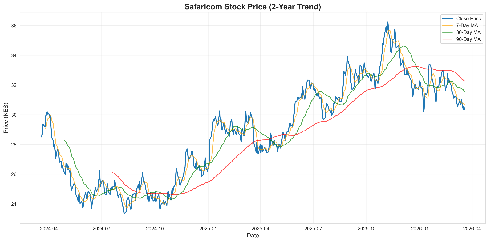
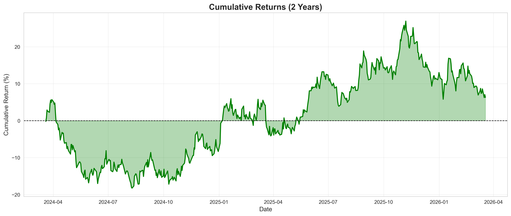

# Safaricom Stock Analysis Project

A comprehensive 2-year stock market analysis of Safaricom PLC (NSE: SCOM) using Python for data analysis and visualization.

##  Project Overview

This project analyzes Safaricom stock performance over a 2-year period, providing insights into:
- Price trends and patterns
- Trading volume analysis
- Risk metrics and volatility
- Statistical performance indicators
- Visual representations of market behavior

## Project Structure
```
safaricom_analysis/
│
├── data/
│   ├── safaricom_stock_data.csv      # Raw stock data
│   └── safaricom_cleaned.csv          # Processed data with features
│
├── charts/
│   ├── 1_price_trend.png              # Price with moving averages
│   ├── 2_returns_distribution.png     # Daily returns histogram
│   ├── 3_volume.png                   # Trading volume
│   ├── 4_cumulative_returns.png       # Cumulative performance
│   ├── 5_monthly_performance.png      # Monthly averages
│   └── 6_volatility.png               # Volatility analysis
│
├── scripts/
│   ├── step1_explore_data.py          # Data exploration
│   ├── step2_prepare_data.py          # Data cleaning & features
│   ├── step3_visualizations.py        # Chart generation
│   ├── step4_statistical_analysis.py  # Statistical metrics
│   └── step5_create_dashboard.py      # HTML dashboard
│
├── safaricom_dashboard.html           # Interactive dashboard
├── analysis_summary.txt               # Key metrics summary
└── README.md                          # This file
```

## Features

### Data Analysis
- **523 trading days** analyzed
- **OHLCV data** (Open, High, Low, Close, Volume)
- **Daily returns** calculation
- **Moving averages** (7-day, 30-day, 90-day)
- **Volatility metrics**
- **Cumulative returns**

### Statistical Metrics
- Total & Annualized Returns
- Sharpe Ratio
- Maximum Drawdown
- Win Rate
- Value at Risk (VaR)
- Skewness & Kurtosis

### Visualizations
- Price trend with moving averages
- Volume analysis
- Returns distribution
- Cumulative performance
- Monthly performance
- Volatility over time

##  Technologies Used

- **Python 3.13**
- **pandas** - Data manipulation
- **numpy** - Numerical computations
- **matplotlib** - Data visualization
- **seaborn** - Statistical graphics

##  Key Findings

View the complete analysis in the [interactive dashboard](safaricom_dashboard.html)

##  How to Run

1. **Clone the repository**
```bash
git clone https://github.com/yourusername/safaricom-analysis.git
cd safaricom-analysis
```

2. **Install dependencies**
```bash
pip install pandas numpy matplotlib seaborn
```

3. **Run the analysis scripts in order**
```bash
python scripts/step1_explore_data.py
python scripts/step2_prepare_data.py
python scripts/step3_visualizations.py
python scripts/step4_statistical_analysis.py
python scripts/step5_create_dashboard.py
```

4. **View the dashboard**
```bash
# Open safaricom_dashboard.html in your browser
```

## Sample Outputs

### Price Trend


### Cumulative Returns


## 🎓 What I Learned

- Time series data analysis
- Financial metrics calculation
- Data visualization best practices
- Statistical analysis techniques
- Professional documentation

## 🔮 Future Enhancements

- [ ] Real-time data integration
- [ ] Machine learning price prediction
- [ ] Comparison with market indices
- [ ] Technical indicators (RSI, MACD, Bollinger Bands)
- [ ] Interactive Plotly/Dash dashboard
- [ ] Automated report generation

## License

This project is open source and available under the [MIT License](LICENSE).

## 👤 Author

**Your Name**
- GitHub: [siraji](https://github.com/sirajiali-hub/safaricom_stock_analysis-.git)
- LinkedIn: [siraji](https://www.linkedin.com/public-profile/settings/?trk=d_flagship3_profile_self_view_public_profile&lipi=urn%3Ali%3Apage%3Ad_flagship3_profile_self_edit_top_card%3BBXFkLb8uSzCTR39JVa4PPw%3D%3D)
- Portfolio: [yourwebsite.com](http://127.0.0.1:5500/safaricom_dashboard.html)

##  Acknowledgments

- Data source: Nairobi Stock Exchange (NSE)
- Inspiration: Financial data analysis projects

---

 If you found this project useful, please consider giving it a star!
